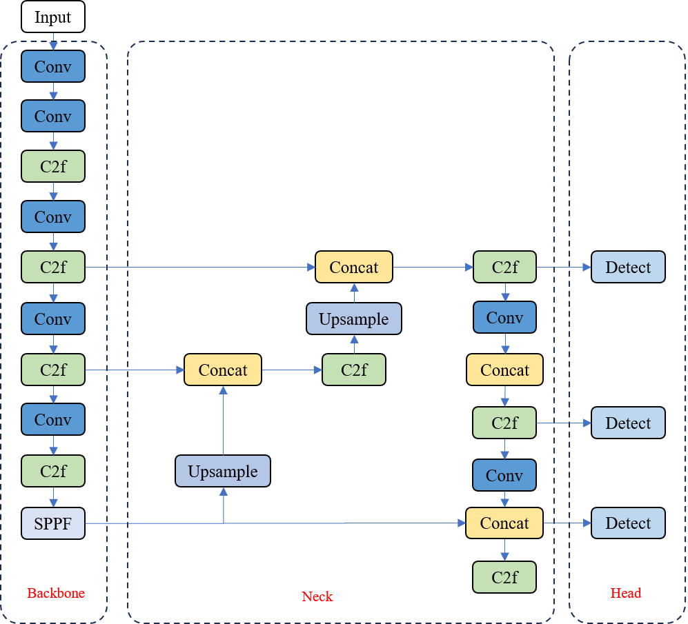
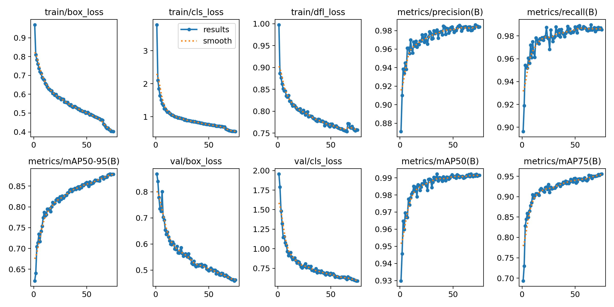
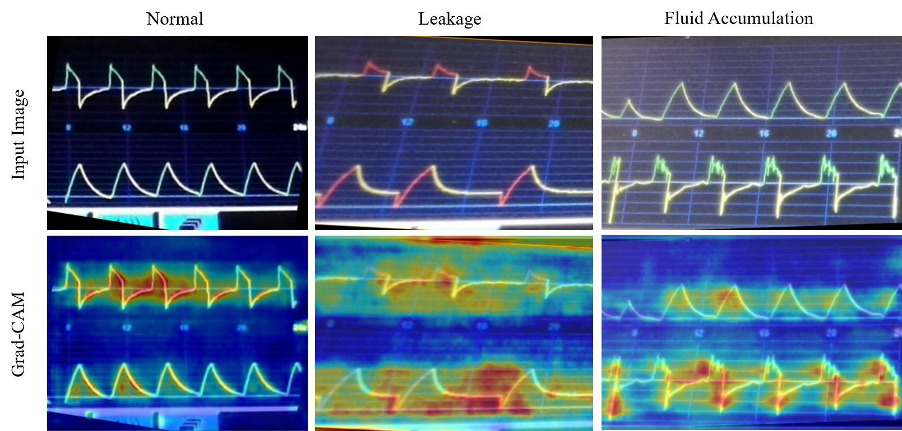
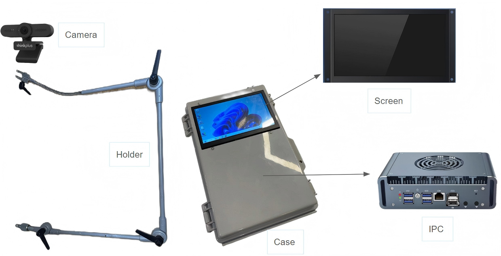

# YOLOv8 Ventilator Waveform Anomaly Detection

This project implements **YOLOv8-based deep learning** for ventilator waveform anomaly detection and classification. It focuses on detecting clinically common waveform anomalies (e.g., leakage, secretion accumulation, double triggering, ineffective effort) in real-time. The model combines **high accuracy** with **low latency**, making it suitable for bedside clinical monitoring.

---

## Features

- **YOLOv8-based Object Detection**  
  High-performance end-to-end detection and classification of ventilator waveforms.

- **Data Preprocessing**  
  Raw waveform images are processed through NanoDet-Plus for region extraction and Hough-based skew correction for improved label quality and generalization.

- **Optimized Training**  
  - **Dataset**: 2,865 labeled waveform images  
  - **mAP@50**: 99.2%  
  - **mAP@50-95**: 88%  
  - Advanced data augmentation (horizontal flip, HSV perturbation, mosaic augmentation, etc.)

- **Real-time Inference**  
  - Model exported to **ONNX** format for CPU inference with OpenCV DNN.  
  - Average inference time: **271 ms** (total pipeline latency < 500 ms).  
  - Suitable for real-time anomaly monitoring.

---

## Model Architecture

  
*Figure 1. YOLOv8 model architecture.*

The YOLOv8 architecture consists of:
1. **Backbone** – Feature extraction with convolutional and bottleneck layers.
2. **Neck** – Multi-scale feature fusion via SPPF (Spatial Pyramid Pooling Fast).
3. **Head** – Anchor-free detection and classification.

---

## Data Processing Pipeline

  
*Figure 2. Workflow: raw image → region extraction → skew correction → resize & pad → model input.*

---

## Dataset

The dataset includes **12 categories** of normal and abnormal waveforms:  
- Normal Flow, Normal Volume  
- Accumulation Flow, Accumulation Volume  
- Leakage Flow, Leakage Volume  
- Double Triggering Flow, Double Triggering Volume  
- Premature Cycling Flow, Premature Cycling Volume  
- Ineffective Effort Flow, Ineffective Effort Volume  

| Label                      | Description                           | Count |
|----------------------------|---------------------------------------|-------|
| Accumulation Flow          | Secretion/Water Accumulation Flow     | 562   |
| Volume                     | Secretion/Water Accumulation Volume   | 562   |
| Leakage Flow               | Leakage Flow                          | 452   |
| Leakage Volume             | Leakage Volume                        | 452   |
| Double Triggering Flow     | Double Triggering Flow                | 510   |
| Double Triggering Volume   | Double Triggering Volume              | 510   |
| Premature Cycling Flow     | Premature Cycling Flow                | 476   |
| Premature Cycling Volume   | Premature Cycling Volume              | 476   |
| Ineffective Effort Flow    | Ineffective Effort Flow               | 438   |
| Ineffective Effort Volume  | Ineffective Effort Volume             | 438   |
| Normal Flow                | Normal Flow                           | 427   |
| Normal Volume              | Normal Volume                         | 427   |

---

## Model Performance Comparison

| Model    | mAP@0.5 | mAP@0.75 | mAP@0.5-0.95 | Size   | FLOPs |
|----------|---------|----------|--------------|--------|-------|
| YOLOv8n  | 0.983   | 0.978    | 0.872        | 6.3MB  | 8.1G  |
| YOLOv8s  | 0.987   | 0.984    | 0.880        | 22.5MB | 28.5G |
| YOLOv7   | 0.989   | 0.981    | 0.866        | 74.9MB |103.3G |
| YOLOv6n  | 0.984   | 0.968    | 0.834        | 4.63MB |11.35G |
| YOLOv5n  | 0.962   | 0.951    | 0.823        | 4.0MB  | 4.2G  |
| YOLOv5s  | 0.987   | 0.975    | 0.844        |14.5MB  |15.9G  |

---

## Loss Curves and Metrics

  
*Figure 3. Loss curves and evaluation metrics (mAP@50, mAP@50-95).*

The training and validation losses show a stable decrease without overfitting. mAP@50 reaches 99.2%, while mAP@50-95 reaches 88%, showing both strong classification and localization performance.

---

## Explainability

  
*Figure 4. Grad-CAM visual explanation of model focus regions.*

The model’s decision-making process is visualized with **Grad-CAM**, highlighting the key areas in waveform images that influence anomaly classification. This improves model interpretability for clinical adoption.

---

## Hardware Deployment

  
*Figure 5. Hardware setup: camera + industrial PC + touchscreen.*

- **Industrial PC**: Intel N100, 16GB RAM.  
- **Camera**: 2K auto-focus, USB interface.  
- **Display**: 7-inch touchscreen (HDMI).  
- **Inference**: OpenCV DNN with ONNX model (CPU-only).

---

## Future Work

- Integrating **Temporal Attention Mechanisms** to capture inter-frame dependencies.  
- Upgrading video acquisition to **4K resolution** for better small-scale anomaly detection.  
- Optimizing detection of low-amplitude waveform asynchronies.

---

## References
 
- R. R. Selvaraju et al., *Grad-CAM: Visual Explanations from Deep Networks via Gradient-based Localization,* arXiv, 2016.

---

